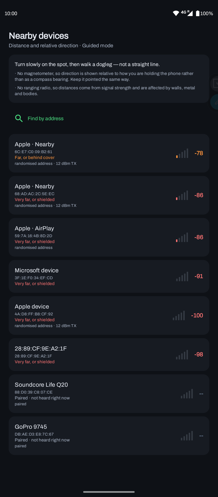
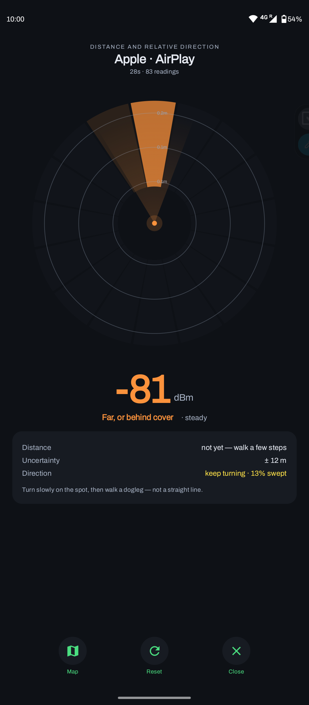
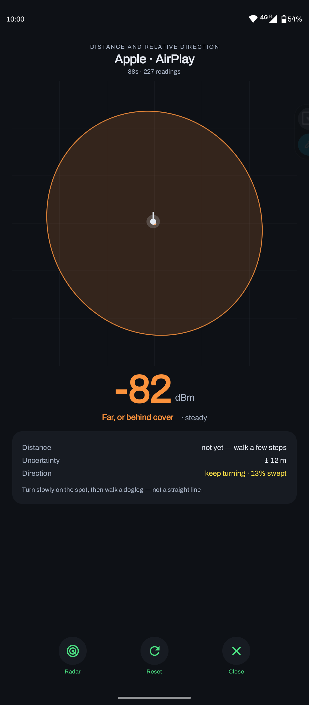
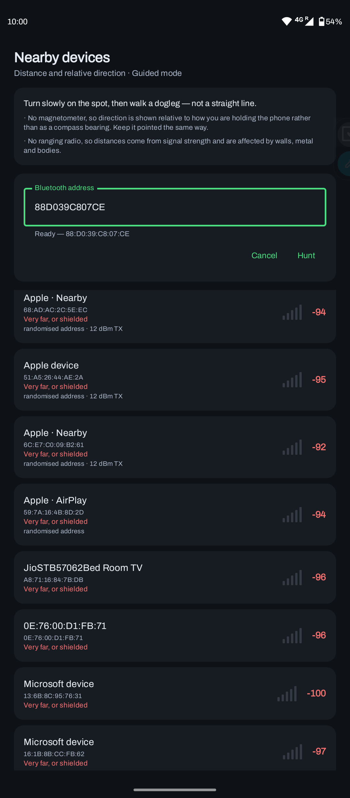
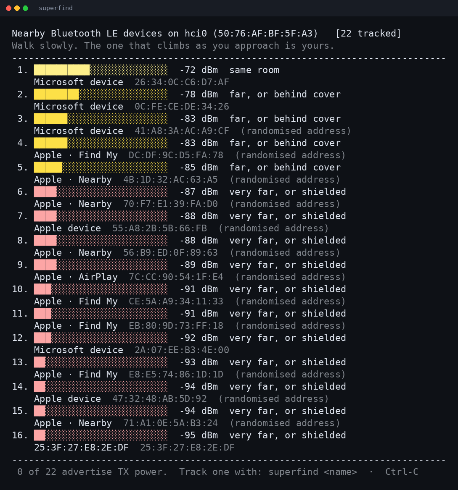
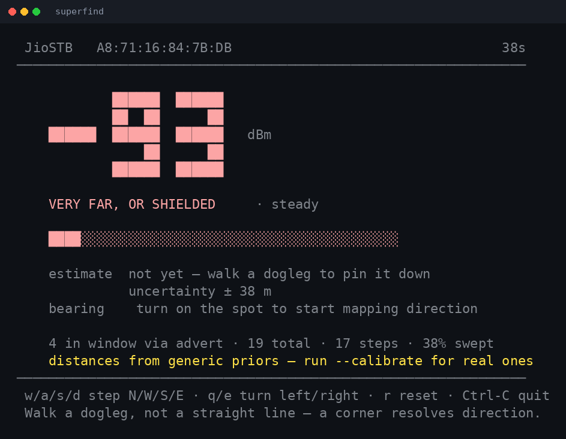

<div align="center">


# Superfind

**Find a device by its radio.**

A sensor-fusion core in Rust, an Android app, and a Linux CLI — all steering by
the same filter.

[](#build-and-run)
[](android/)
[](crates/superfind-core)
[](#privacy)

</div>

---

<div align="center">

&nbsp;
&nbsp;
&nbsp;


</div>

Left to right: **the list**, where devices are described by what they broadcast
rather than by a rotating hex address. **The radar**, where the lit sectors are
the ones you have already swept — the gap *is* the instruction. **The map**,
drawing the 95% confidence ellipse and never a dot; it is that large here
precisely because the phone had not moved yet. **Find by address**, for when you
know the MAC but the device is not advertising right now.

Plan in [`docs/design.md`](docs/design.md); the radio and licensing groundwork in
[`docs/platform-plan.md`](docs/platform-plan.md).

## Status

| Component | State |
|---|---|
| `superfind-core` — fusion, filtering, bearing, capability tiers | 101 tests |
| `superfind-jni` — JNI bridge, flat-array snapshot encoding | 4 tests |
| `superfind-cli` — BlueZ scanner + hunt UI | working, verified on real hardware |
| [`android/`](android/) — Compose radar app, Android 6 to 16 | working, verified on a Moto G40 Fusion |
| Offline-finding network clients (FMDN, Find My) | not started — Phase 2 |

Private repository. Mirrored to GitHub and GitLab; APKs are attached to GitHub
releases.

## Getting an APK

Tag a commit and CI builds and publishes it:

```sh
git tag v0.1.0 && git push origin v0.1.0
```

The APK is debug-signed, so Android warns on install — this is a private build,
not a store release. F-Droid and Play Store packaging comes later, and will need
a real signing key held outside this repository.

## Hunting with more than one device

One observer sees an annulus — "somewhere on a ring around me" — which is why
the app asks you to walk a dogleg. Two observers intersect two rings, standing
still.

```sh
# On the anchoring device, which defines the origin:
superfind --share kitchen --at 0,0 "Pixel"

# On a second device, eight metres east of it:
superfind --share kitchen --at 8,0 "Pixel"
```

Each shares its readings over the local network, and each folds the other's in
at the position it was taken from. The status line reports how many readings
came from peers, because that is the difference between an annulus and a fix.

**Two observers are not enough for a unique answer.** Two circles meet at two
points, so the target stays indistinguishable from its reflection in the line
joining the observers — the ambiguity is geometric and precision cannot touch
it. The posterior honestly straddles both lobes, which is why the point estimate
can be metres out while the ellipse is small. A third observer off that line
resolves it, and so does one observer taking a few steps sideways. All three
cases are pinned down by tests.

The hard part is the shared frame: nothing in Bluetooth tells two phones where
they are relative to each other, so `--at` is typed by a human with a tape
measure or a floor plan. A peer that cannot say where it is contributes nothing
and is dropped rather than fused, because a range from an unknown centre
constrains nothing at all.

Sharing is off unless asked for. The packets carry the hunted address and rough
positions, and anything on the same network can read them.

## Which floor it is on

Every locator on the market answers in two dimensions and then leaves you
searching the wrong storey. A barometer settles it: pressure falls about 12 Pa
per metre, and phone barometers resolve well under that.

Only *differences* are reported. Absolute altitude needs the weather — being
wrong about sea-level pressure by 1 hPa moves the answer two storeys — and a
difference from a reference taken when the hunt began cancels that almost
entirely. The output is a floor count with half a storey of deadband, so a desk
and the floor beside it never read as different levels.

## Devices that have been travelling with you

The same scan that finds your keys will notice a tracker slipped into your bag.
That is not a coincidence; it is the same measurement read the other way, and
the [DULT specification][dult] exists because the capability is unavoidable.

What matters is persistence across *places you have moved between* — not
loudness, and not duration. A device on your desk all afternoon has followed
nobody; a tag present across a kilometre of walking has. Every threshold errs
towards silence, because telling somebody they are being followed when they are
not invites them to search their own belongings and distrust their colleagues.

It reports co-travel, which is not proof of malice, and the wording says so.

[dult]: https://developers.google.com/nearby/fast-pair/specifications/extensions/fmdn

## The Linux CLI

<div align="center">

&nbsp;


</div>

Same fusion core as the app, same honesty. The survey describes devices by what
they advertise rather than by a rotating address; hunt mode shows the reading in
a block font legible across a room, and withholds a distance it has not earned.

Movement is typed rather than sensed, because a laptop has no compass or step
counter — which turns out to be an advantage for validation: the ground truth is
*exact*, so any error belongs to the filter rather than to a noisy pedometer.

## Build and run

No system packages needed. Just a Rust toolchain.

```sh
cargo test --workspace          # 115 tests
cargo build --release

./target/release/superfind                    # survey every nearby BLE device
./target/release/superfind --list             # devices BlueZ knows, plus calibration state
./target/release/superfind <name|address>     # hunt one device
./target/release/superfind --calibrate <name> # fit this device's path loss
```

Linux needs `bluetoothd` running and an adapter powered on (`bluetoothctl power
on`). No root: BlueZ discovery over D-Bus is permitted for ordinary users.

### Hunt mode controls

A laptop has no compass and no step counter, so movement is typed:

```
w a s d    step north / west / south / east
q e        turn 22.5° left / right on the spot
r          reset the filter
```

This is clumsy for everyday use and excellent for validation: the ground truth
is *exact*, so any error in the estimate belongs to the filter rather than to a
noisy pedometer. Walk a known 5 m dogleg, compare the reported fix to the tape
measure, and you know whether the fusion is right before porting it to a phone.

## Calibration

The built-in path-loss priors (`-59 dBm` at 1 m, exponent `2.8`) come from
published indoor studies, not from your hardware. Transmit power varies by more
than 15 dB across devices, and that error maps straight into a multiplicative
distance error — assume a device is 15 dB louder than it is and every distance
reads about a third of the truth.

```sh
superfind --calibrate "my phone"
```

You are asked to place the device at 1, 2, 4 and 8 m — geometric spacing,
because path loss is linear in `log10(d)`, so doubling spaces the samples evenly
along the axis the regression actually fits. It collects 25 samples at each,
fits both parameters by least squares, and reports the RMS residual.

**The fit is checked before it is saved.** Least squares always returns
*something*; in a reflective corridor it will happily return an exponent of 1.1
or a 1 m reference of -12 dBm, and the filter would then be confidently wrong
rather than honestly uncertain. A fit is rejected if it is physically implausible
or if the residual exceeds 8 dB, and the priors are kept instead. A tidy indoor
fit lands around 3–5 dB.

Results live in `~/.config/superfind/calibration.json`, keyed by address, and are
picked up automatically when hunting. `--no-calibration` ignores them. The hunt
view always states which model the distances came from, because a fitted model
and a prior can disagree by a factor of three.

## What the numbers mean

The reading is signal strength in dBm — negative, closer to zero when nearer.

| dBm | Rough meaning |
|---|---|
| −45 up | arm's reach |
| −60 | same table |
| −72 | same room |
| −85 | far, or behind cover |
| below | very far, or shielded |

Signal strength is a coarse proxy for distance. Metal, walls and human bodies
attenuate it heavily, so a phone in a filing cabinet two metres away can read the
same as one fifteen metres away in open air. Trust the trend as you move, not any
single number.

**Walk a dogleg, not a straight line.** Ranges measured from points along a
straight line cannot distinguish a target from its mirror image in that line —
the ambiguity is geometric, and no amount of precision removes it. Twenty steps
around a corner beat two hundred in a straight line. This is pinned down by a
test: `a_straight_line_walk_leaves_a_mirror_ambiguity`.

## Privacy

The app requests no `INTERNET` permission, so nothing it hears can leave the
phone. On Android 12 and later, Bluetooth scanning is declared
`neverForLocation`, so your whereabouts are never requested either — the only
thing being measured is signal strength.

Rotating addresses belonging to other people's devices are held for the duration
of a session and never written to disk.

## Repository layout

```
crates/superfind-core/   the fusion filter — no dependencies, no platform
crates/superfind-jni/    JNI bridge to the Android app
crates/superfind-cli/    Linux CLI, BlueZ over pure-Rust zbus
android/                 Compose app; see android/README.md
scripts/build-jni.sh     cross-compiles the core for Android ABIs
docs/                    design and platform research
```

Build outputs are not committed. `jniLibs/` and `.cargo/config.toml` are both
generated by `scripts/build-jni.sh`, and the latter holds absolute NDK paths that
are only valid on the machine that produced them.

## Design

### The core is the product

`superfind-core` has no dependencies and no platform in it. Everything is
arithmetic over observations that some other layer collected — BlueZ today, the
Android Ranging API next, CoreBluetooth on a borrowed Mac eventually. That
boundary means the filter can be tested exhaustively on a laptop, replayed from
recorded traces, and reused unchanged by every front end.

```
measurement  →  observations, each carrying its own noise term
pathloss     →  dBm to metres, and the likelihood the filter actually uses
motion       →  pedestrian dead reckoning: where the user is
filter       →  particle filter over target position
bearing      →  direction inferred from a swept RSSI aperture
tracker      →  the facade, and the immutable snapshot a UI renders
```

### Why particles, not a Kalman filter

The RSSI likelihood is wildly non-Gaussian in position space. One reading says
"the device is somewhere on an annulus around me"; two readings from different
places say "near one of the two intersections". That posterior is ring-shaped and
often bimodal, and an extended Kalman filter would average the two intersections
and confidently point at the empty space between them.

### Everything carries its uncertainty

The filter returns `None` before any evidence arrives rather than dressing up its
prior. The bearing estimator refuses to answer from a narrow sweep however many
samples it holds. A *measured* angle (UWB angle-of-arrival) and an *inferred*
bearing (swept RSSI) are separate types, so a UI cannot accidentally draw the same
confident arrow for both.

Confidence is the product of coverage, concentration and significance —
multiplied, not averaged, because any one of them being near zero should sink the
answer. Low numbers are the system working.

## Inherited from findphone

This began as a port of the reasoning in
[findphone](https://github.com/ben-z/findphone), a macOS CLI worth reading for
its intellectual honesty — it counts a measurement only when the underlying value
actually changes, and reports a much smaller number than its poll rate as a
result, because that number is the true one.

Two of its bugs are encoded here as regression tests:

- **The better source wins the window outright.** findphone blended
  connected-link RSSI with passively observed advertisements in one median.
  Adverts arrive far faster, so the noisier source outvoted the better one. See
  `the_better_source_wins_the_window_outright`.
- **Staleness is surfaced**, so silence can mean "no signal" rather than "no
  device". See `staleness_is_reported_so_silence_can_mean_no_signal`.

The same trap appears on Linux and is why the BlueZ backend uses D-Bus
`PropertiesChanged` signals rather than polling `GetManagedObjects`. BlueZ serves
a cached RSSI between advertisements; re-reading it would feed the filter
duplicate "evidence" and make it arbitrarily overconfident. See the module
comment in `ble.rs`.

## Known limitations

- **Linux only for now.** The BlueZ backend is `cfg(target_os = "linux")`. The
  Windows path needs a WinRT backend behind the same interface; nothing in the
  core changes.
- **No connected-link RSSI, and not for want of trying.** BlueZ 5.72's
  `org.bluez.Device1` exposes `RSSI` and `TxPower`, both derived from
  *advertising*, and no connection RSSI at all. The HCI `Read_RSSI` command that
  would give it needs a raw `AF_BLUETOOTH`/`BTPROTO_HCI` socket and
  `CAP_NET_RAW`. So the CLI observes advertisements only — the noisier of the two
  sources, declared as `RssiSource::Advertisement` so the filter widens its noise
  accordingly. Android exposes connected-link RSSI directly, so this gap closes
  on the platform that matters most.
- **Almost nothing advertises TX power.** The AD type exists and BlueZ surveys it
  (`Device1.TxPower`), which would hand us a calibration reference for free.
  Measured against 7 devices in a normal room: **0 advertised it.** Fast Pair and
  FMDN beacons carry it; ordinary phones, TVs and cheap tags do not. Survey mode
  reports the count so you can check your own environment. Guided calibration is
  therefore the real path, not a fallback.
- **No ranging radio on a laptop.** UWB, Channel Sounding and Wi-Fi RTT paths are
  implemented and tested in the core against synthetic data, but nothing on this
  machine can produce those measurements. Android is where they get exercised.

## Next

Phase 1 is the Android app: the same core via `flutter_rust_bridge`, fed by the
Android 16 unified Ranging API (UWB + Bluetooth Channel Sounding + Wi-Fi NAN
RTT). That is the step where the estimate stops being a guess with error bars and
starts being sub-metre truth.
